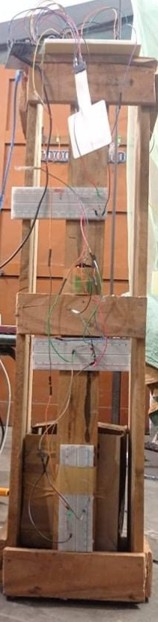
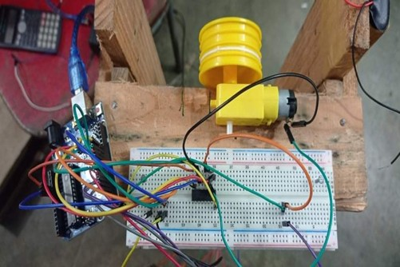
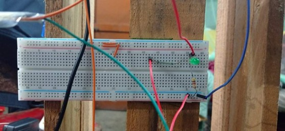

# Arduino-Based 3-Floor Elevator System

This project presents the **design and implementation of a 3-floor elevator prototype**. It was developed as a course project by **Group 08** for **EEE 318 – Control System Laboratory**.

The study focuses on building a functional vertical transport system using an **Arduino Uno** to manage motor control and floor positioning. The system demonstrates how sensor feedback from **reed switches** can be used to automate movement and ensure the elevator stops accurately at designated levels.

---

## Key Features

- **Three-Floor Logic:**  
  Prototype designed to navigate between three distinct levels.

- **Magnetic Position Sensing:**  
  Use of **reed switch sensors** and **magnets** to detect the elevator’s current position.

- **Keypad Interface:**  
  Integration of a keypad allowing users to select their destination floor.

- **Advanced Motor Control:**  
  Implementation of **Pulse Width Modulation (PWM)** to manage different speeds for upward and downward travel.

- **H-Bridge Integration:**  
  Use of an **L293D motor driver** to interface low-voltage Arduino control signals with higher-power motor requirements.

---

## System Overview

- **Test System:** 3-Floor Elevator Prototype  
- **Main Controller:** Arduino Uno  
- **Frame Material:** Wood  
- **Simulation / Control Software:** Arduino IDE (C++ based)

### Movement Components

- DC motor for mechanical rotation  
- L293D motor driver with dual H-bridge  

### Input / Output

- 3-button keypad connected to Arduino pins  
- Magnets and reed switches for floor detection  

---

## Operational Parameters

- **Upward Movement:** PWM value set to **175**  
- **Downward Movement:** PWM value set to **30**  
- **Off / Idle State:** PWM value set to **50**  
- **Sensory Feedback:**  
  Reed switch sensors detect magnetic fields and signal the Arduino to stop the motor at the correct floor.
  

---

## Project Impact

This project demonstrates the practical application of **microcontrollers in automation and control systems**. It provides hands-on experience in integrating diverse hardware components—such as magnetic sensors, keypads, and motor drivers—to solve real-world engineering challenges related to vertical transportation.

---

## Project Status

✅ **Completed** — Functional hardware demonstration verified for all three floors.

---

## Contributors

- **Joy Saha (1706189)**  
- **Ishtiaque Ahmed (1706190)**  
- **Tasnim Rahman (1706191)**  
- **Aung Shay Sing Marma (1706195)**

  
**Group No:** 08

Department of Electrical and Electronic Engineering\
Bangladesh University of Engineering and Technology (BUET)

---

## License

This project is for **academic and educational purposes only**.
